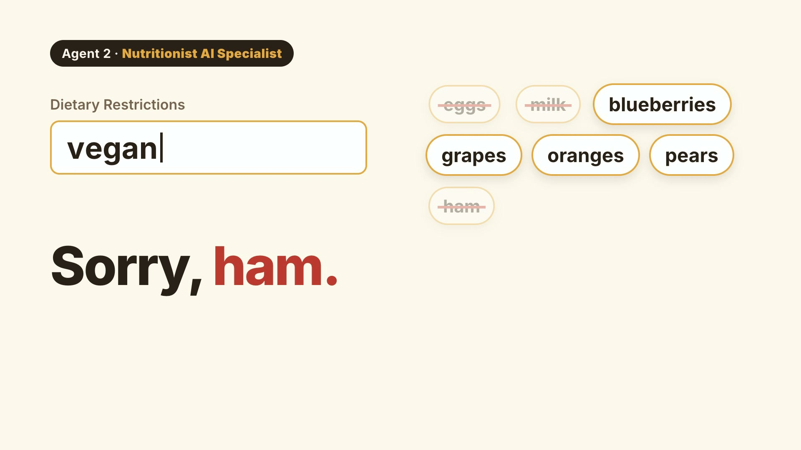

# NourishBot — Multi-Agent Nutrition Assistant

**Author:** Anas AlGhannam  
**Contributor:** [Anas AlGhannam (@AnasAlghannam)](https://github.com/AnasAlghannam)

A CrewAI application that turns a set of ingredients into either **recipe ideas** or a **nutritional
analysis**, using four specialized agents that hand work to one another.

[](https://github.com/AnasAlghannam/Multi-Agent-Systems-Projects/blob/main/NourishBot/brag-output/brag.mp4)

*23 seconds, sound on. Every recipe and number in it is real output from the crews, run on the
example photos in `examples/`.*

| Agent | Responsibility |
|-------|----------------|
| Ingredient detection | Identifies ingredients (from an image, or from a typed list) |
| Dietary filtering | Removes anything that breaks a stated restriction — vegan, gluten-free, … |
| Nutrient analysis | Estimates calories and breaks down macro- and micronutrients |
| Recipe / evaluation | Suggests recipes, or evaluates how healthy the meal is |

Two workflows share those agents:

- **recipe** — from a fridge photo or ingredient list, propose dishes you can actually make
- **analysis** — from a plated dish, estimate calories and nutrients and evaluate healthiness

Structured output is enforced with Pydantic models (`src/models.py`), so results come back as data
rather than prose, and the Gradio UI renders them as tables.

## Layout

| Path | Purpose |
|------|---------|
| `app.py` | Gradio UI and output formatting |
| `src/crew.py` | `@CrewBase` classes wiring agents and tasks to the YAML config |
| `src/config/agents.yaml` | Agent roles, goals, and backstories |
| `src/config/tasks.yaml` | Task descriptions and expected outputs |
| `src/tools.py` | Tools the agents call (ingredient extraction, filtering, analysis) |
| `src/models.py` | Pydantic schemas for structured output |
| `src/llm.py` | Single place where model access is configured |

## Setup

```bash
cd NourishBot
python3 -m venv .venv
source .venv/bin/activate            # Windows: .venv\Scripts\activate
pip install --upgrade pip
pip install -r requirements.txt
```

> Use a fresh virtual environment rather than a base Anaconda environment — installing crewAI into
> base Anaconda can break its `protobuf` and cause a `libprotobuf` load error.

### API key

```bash
cp .env.example .env
```

Set `GROQ_API_KEY` — free at [console.groq.com/keys](https://console.groq.com/keys). `.env` is
git-ignored.

## About the image feature

Ingredient detection from a photo needs a **vision-capable** model. Not every Groq account exposes
one, so the app handles both cases:

- **With a vision model** — set `NOURISH_VISION_MODEL` in `.env` to a multimodal model your account
  can use. Upload a photo and the detection agent reads the ingredients from it.
- **Without one** — leave `NOURISH_VISION_MODEL` blank. The UI shows an **Ingredients** box; type a
  comma-separated list and the remaining three agents run exactly as they would otherwise.

To see which models your account can use:

```bash
python -c "import os;from dotenv import load_dotenv,find_dotenv;load_dotenv(find_dotenv());from groq import Groq;print(*sorted(m.id for m in Groq(api_key=os.environ['GROQ_API_KEY']).models.list().data),sep='\n')"
```

## Verify it works

**1. Key and model**

```bash
python -c "from src.llm import chat; print(chat('Reply with exactly: OK'))"
```

**2. Crew wiring**

```bash
python verify_setup.py
```

Builds both crews and runs the analysis workflow on a sample ingredient list.

**3. Launch the UI**

```bash
python app.py
```

Open <http://127.0.0.1:7862>.

## Configuration

| Variable | Default | Meaning |
|----------|---------|---------|
| `GROQ_API_KEY` | — | Required. |
| `NOURISH_TEXT_MODEL` | `llama-3.3-70b-versatile` | Model behind all four agents. |
| `NOURISH_VISION_MODEL` | *(blank)* | Vision model for image input. Blank enables the manual-ingredients fallback. |
| `APP_PORT` | `7862` | Port for the Gradio UI. |
| `APP_SHARE` | unset | Set to `1` to expose a public tunnel. Off by default. |

Agent behaviour lives in `src/config/agents.yaml` and `src/config/tasks.yaml` — edit the prompts
there without touching Python.

## Disclaimer

Calorie and nutrient figures are model estimates, not measurements, and vary with portion size,
preparation, and specific ingredients. This is a demonstration of a multi-agent architecture, not
dietary or medical advice.
